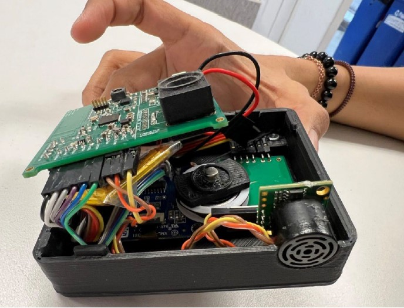

<h1 style="text-align: center;">CUBIT</h1>

## Background
Measuring tapes have been in use for centuries and are still the primary tool for taking measurements. However, they have several limitations, including the tedious process of taking and maintaining measurements and the fact that the measurements are single-use. Therefore, our team has designed a smart measuring instrument to digitize the data, which can be easily stored and accessed from anywhere.

## Summary
Our smart measuring instrument takes precise linear and angular measurements and transmits the data over to a mobile application using Bluetooth. The device have an encoder-wheel assembly that helps take measurements over a straight or curved surface accurately. A high precision rotary encoder provides high-resolution results, while an inertial measurement unit (IMU) sensor takes different angular and device orientation data. The device is powered by a small battery and contains an energy harvesting system using solar panels to recharge the battery. The device operates in low power mode by implementing load power management and utilizing minimum current for required peripherals.

  

## Getting Started

### Prerequisites:
* Altium Designer (for PCB design)
* Embedded C
* Bluetooth Low Energy (BLE) protocol basics
* Event-driven programming
* System design and implementation basics

### Installing:
* Install Altium Designer from [here](https://www.altium.com/downloads/altium-designer) (free for students). The project was designed using Altium Designer 22.10.1
* Install Simplicity Studio using this [link](https://www.silabs.com/developers/simplicity-studio). Set up the development environment for the EFR32BG13P732f512 microcontroller. This project works on sdk 3.2.3. It is easier to set up the environment with the [evaluation kit](https://www.silabs.com/documents/public/user-guides/ug279-brd4104a-user-guide.pdf). 

Following pages describe the approach used in development of this project over 15 weeks. This is a good example of how to design an embedded product from scratch.

## Hardware:

- [Selection of Components](https://github.com/rajatchaple/ecen5833_s22_lpedt_project/wiki/Selection-of-Components)
- [Power management unit selection](https://github.com/rajatchaple/ecen5833_s22_lpedt_project/wiki/Power-Management)
- [PMIC Simulation and Bulk capacitance](https://github.com/rajatchaple/ecen5833_s22_lpedt_project/wiki/Bulk-Capacitance-Requirement)
- Altium Schematic
- Altium Layout Design
- Fabrication and Assembly

## Software:
- LCD bring up
- IMU bring up
- Ultrasonic sensor bring up
- Encoder bring up
- Event driven programming
- BLE configuration
- Managing energy modes

## Application
Our product can be used to fulfill a majority of measurement requirements, including taking size data of a straight or uneven surface and taking angle measurements. It can be used in small industries, construction sites, fashion companies, and regular households. This product will eliminate the need to manually store measured data, and it will be low cost, low power-consuming with an energy harvesting mechanism. Additionally, it will use long-lasting rechargeable batteries, unlike single-usage dry cells.